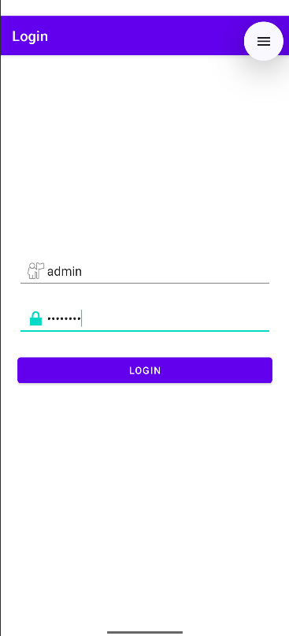
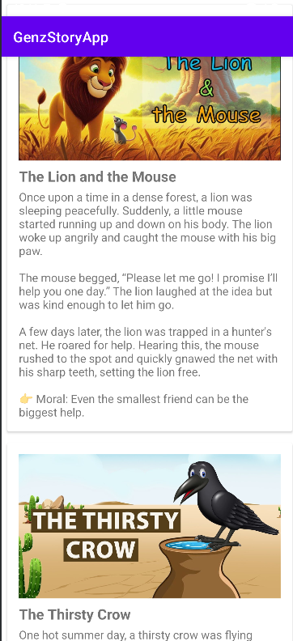
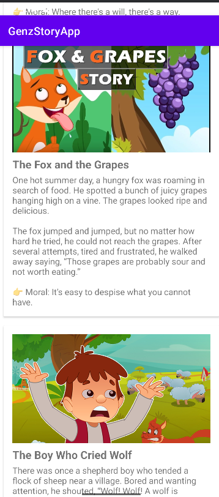

## GenZ Story App 
 It is an engaging Android application designed for children, offering a collection of short stories with built-in text-to-speech narration and read-along highlighting. 
 It aims to promote early reading habits by combining fun storytelling with audio support.
 ______________________________________________________________________________________________________________________________________________________________________________
 ## Built With

-  **Language**: Java (can be extended to Kotlin)
-  **Framework**: Android SDK
-  **UI Design**: XML Layouts
-  **Voice Feature**: Android TextToSpeech API
-  **IDE**: Android Studio

______________________________________________________________________________________________________________________________________________________________________________
 ## Features
  -  **Story Library** – Short, child-friendly stories with text

  -  **Voice Narration** – Uses Android's TextToSpeech engine to read stories aloud

  -  **Read-Along Mode** – Highlights text as it's being read for better engagement

  -  **Colorful UI** – Simple and playful design tailored for kids

  -  **Easily Add Stories** – New stories can be added by modifying text files or database (future enhancement)
______________________________________________________________________________________________________________________________________________________________________________

### Login Screen

### Voice Narration in Action1

This screen shows the Text-to-Speech engine reading the story aloud.

Framework: Android SDK (Android Studio)

### Voice Narration in Action2

This screen shows the Text-to-Speech engine reading the story aloud.

Framework: Android SDK (Android Studio)

### UI: XML Layouts

### Voice: Android TextToSpeech API
______________________________________________________________________________________________________________________________________________________________________________

###  How It Works
Story text is loaded from static files or string resources

Text-to-Speech reads the text aloud

As the voice plays, matching words are optionally highlighted (WIP or future scope)
______________________________________________________________________________________________________________________________________________________________________________

### Target Users
Children aged 3–10 years

Pre-schoolers and early readers

Childrens who are blind help this app to hear the audio of the story

Parents and educators looking for digital storybooks
______________________________________________________________________________________________________________________________________________________________________________
## Future Enhancements
 Upload stories dynamically from a backend or Firebase

 Add multilingual support (Tamil, Hindi, etc.)

 Allow parents to record their voice as narrator

 Add illustrated images with animations

 Dark mode and accessibility improvements
______________________________________________________________________________________________________________________________________________________________________________
## Getting Started (for Developers)
Clone this repo:
bash
Copy
Edit
git clone https://github.com/your-username/GenZStoryApp.git
Open in Android Studio

Build and run on an emulator or physical device (API 21+ recommended)
______________________________________________________________________________________________________________________________________________________________________________

## License
This project is for educational and non-commercial use only. Feel free to modify and use with credit.

